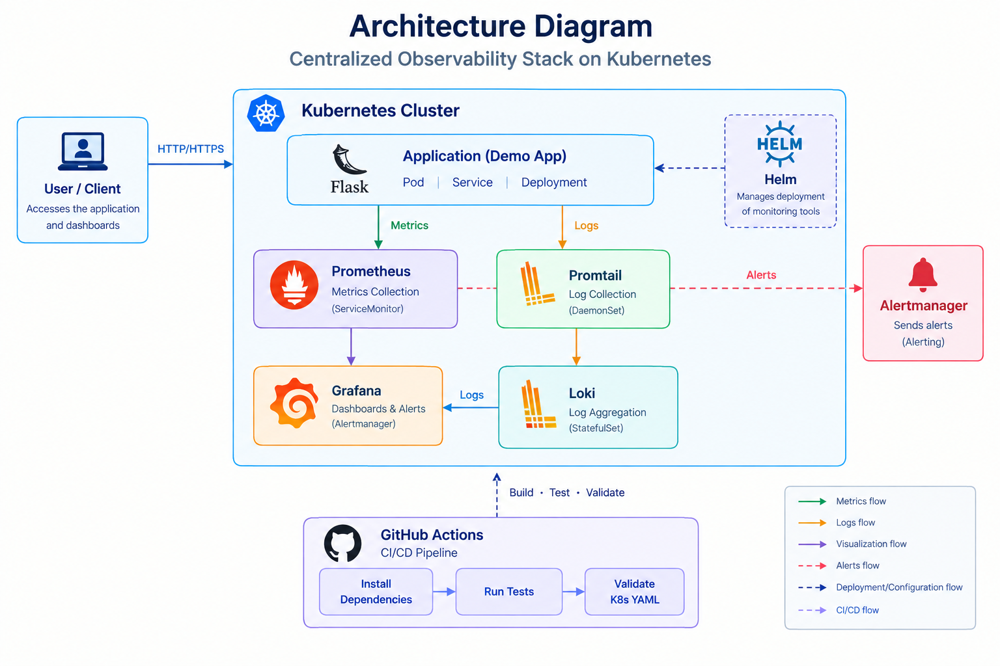

 Centralized Observability Stack
[](https://github.com/mounika-gutha/centralized-observability-stack/actions/workflows/ci.yml)

A Kubernetes-based monitoring and logging project built to understand how applications can be monitored, analyzed, and managed in a containerized environment.

This project integrates **Prometheus, Grafana, Loki, Promtail, Alertmanager, Helm, and GitHub Actions** to provide application monitoring, centralized logging, visualization, and CI automation.

 🌟 Highlights

- 🚀 Deployed a Flask application on a local Kubernetes cluster using Kind.
- 📊 Collected application metrics using Prometheus.
- 📈 Created Grafana dashboards for monitoring application performance.
- 📝 Collected and centralized Kubernetes logs using Promtail and Loki.
- 🚨 Configured alerting rules to identify application availability issues.
- ⚙️ Used Helm to deploy and manage monitoring components.
- 🔄 Implemented GitHub Actions for automated testing and Kubernetes YAML validation.

 🏗️ Architecture

The project uses a Kubernetes-based observability architecture.



 Main Components

| Component | Purpose |
|---|---|
| Flask | Demo application |
| Kubernetes (Kind) | Runs and manages the application |
| Prometheus | Collects application metrics |
| Grafana | Visualizes metrics and logs |
| Promtail | Collects application logs |
| Loki | Stores and aggregates logs |
| Alertmanager | Manages monitoring alerts |
| Helm | Deploys monitoring components |
| GitHub Actions | Automates testing and validation |

ℹ️ Project Overview

I developed this project to gain practical experience with application monitoring, centralized logging, and Kubernetes observability.

The project starts with a Flask application deployed on a local Kubernetes cluster. Prometheus collects application metrics, such as HTTP request counts and request latency, through a configured ServiceMonitor.

Grafana connects to Prometheus and Loki to provide a centralized view of application performance and logs. Promtail collects logs from the Kubernetes environment and forwards them to Loki. Prometheus alerting rules are used to identify application availability issues.

GitHub Actions is used to automate application testing and Kubernetes YAML validation whenever changes are pushed or a pull request is created.

🔄 Project Workflow

 1. Application Deployment

The Flask application is packaged and deployed on a local Kubernetes cluster using Kind. Kubernetes Deployments manage the application pods, and a Service provides access to the application.

 2. Metrics Collection

The application exposes metrics through the `/metrics` endpoint. Prometheus collects these metrics using a ServiceMonitor.

The collected metrics include:

- HTTP request count
- Request latency
- Application availability

 3. Monitoring and Visualization

Grafana is connected to Prometheus to display application metrics through dashboards.

These dashboards help visualize application health, request rates, and response latency.

 4. Centralized Logging

Promtail collects logs from the Kubernetes environment and forwards them to Loki.

Loki provides centralized log storage and allows logs to be searched and analyzed through Grafana.

 5. Alert Management

Prometheus alerting rules are configured to detect defined application issues, such as application unavailability.

Alertmanager manages the generated alerts.

 6. CI Automation

GitHub Actions runs automated checks when code is pushed or a pull request is created.

The CI pipeline:

- Installs application dependencies.
- Compiles Python files.
- Runs application tests.
- Validates Kubernetes YAML files.

 🛠️ Technologies Used

- Python
- Flask
- Kubernetes
- Kind
- Helm
- Prometheus
- Grafana
- Loki
- Promtail
- Alertmanager
- GitHub Actions
- Git
- Linux / Ubuntu WSL

 📁 Project Structure

```text
centralized-observability-stack/
│
├── app/
│   ├── app.py
│   ├── requirements.txt
│   └── Dockerfile
│
├── k8s/
│   ├── namespace.yaml
│   ├── app-deployment.yaml
│   ├── app-service.yaml
│   ├── app-servicemonitor.yaml
│   └── app-prometheusrule.yaml
│
├── helm/
│   ├── kube-prometheus-stack-values.yaml
│   ├── loki-values.yaml
│   └── promtail-values.yaml
│
├── scripts/
│   ├── build-and-load-kind.sh
│   └── deploy.sh
│
├── tests/
│   └── test_app.py
│
├── .github/
│   └── workflows/
│       └── ci.yml
│
└── README.md
```

 🧪 Testing

The project includes application tests and automated CI validation.

The tests verify:

- Flask home endpoint
- Application health endpoint
- Prometheus metrics endpoint

GitHub Actions runs these checks and validates Kubernetes YAML configuration files.

 📚 Learning Outcomes

Through this project, I gained practical experience in:

- Deploying applications using Kubernetes.
- Monitoring applications using Prometheus.
- Creating dashboards in Grafana.
- Collecting and managing logs using Loki and Promtail.
- Configuring basic monitoring alerts.
- Using Helm for Kubernetes deployments.
- Automating testing with GitHub Actions.
- Working with Git branches and pull requests.

 🚀 Future Improvements

- Add application performance dashboards.
- Configure external alert notifications.
- Introduce persistent storage for monitoring data.
- Add more application-level alerting rules.
- Improve CI/CD with automated deployment stages.

 👩‍💻 Author

**Mounika Gutha**

B.Tech Computer Science Engineering  
Specialization: Artificial Intelligence and Machine Learning

Interested in DevOps, MLOps, Kubernetes, CI/CD, and cloud technologies.

 📄 License

This project was created for learning and practical experience in Kubernetes observability and DevOps practices.
